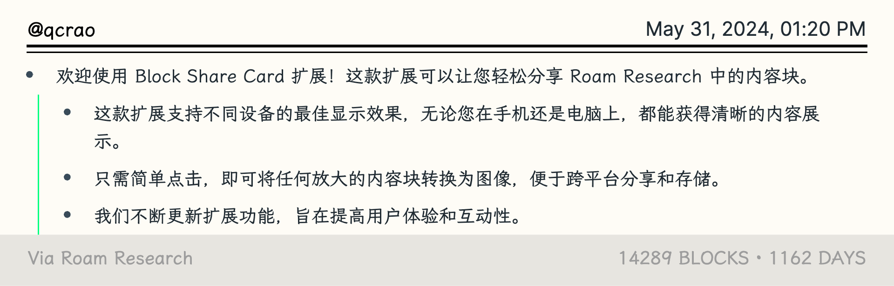
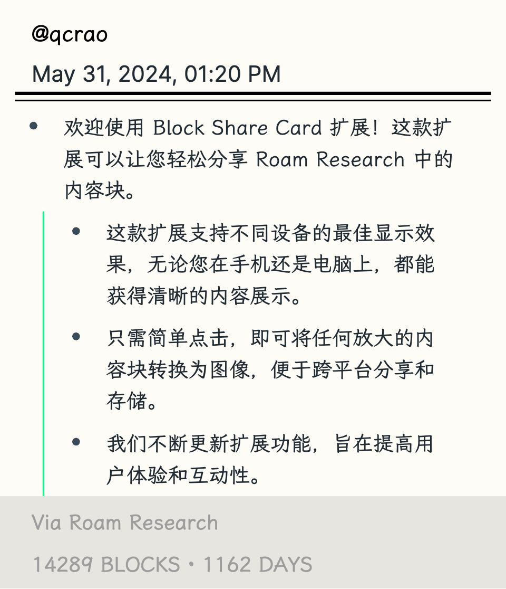
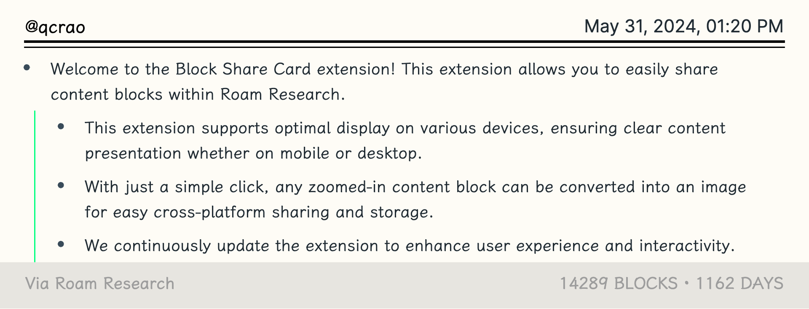
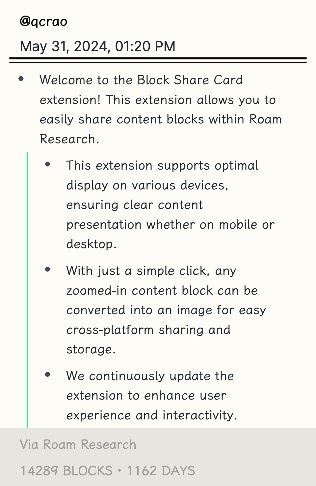
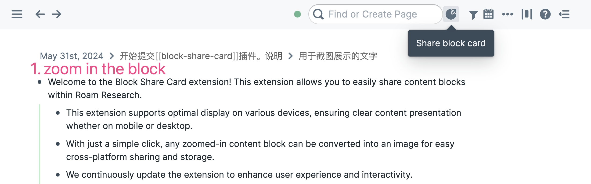
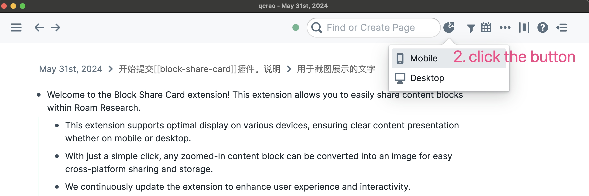
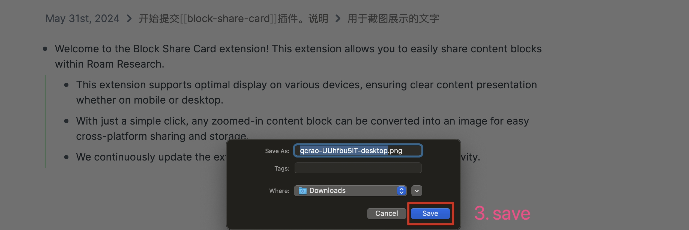

# Block Share Card Extension for Roam Research

The Block Share Card extension for Roam Research enables users to effortlessly share the currently zoomed-in block as an image, tailored for optimal viewing on mobile and desktop devices.

This extension enhances the user experience by simplifying the sharing process and ensuring content is easily readable on any device.

## Screenshots

| Desktop View                   | Mobile View                   |
|--------------------------------|-------------------------------|
|  |  |
|  |  |

## Features

- **Instant Block Sharing:** Quickly share any zoomed-in block from your Roam Research page with a single click.
- **Mobile and Desktop Optimization:** Choose from two image export options designed for different device displays:
  - **Mobile:** Creates a narrower image, perfect for viewing on mobile devices.
  - **Desktop:** Generates a wider image, ideal for desktop screens.

## Installation

1. Open Roam Research and navigate to Roam Depot.
2. Search for "Block Share Card" in the Roam Depot's search bar.
3. Click the "Install" button to add the Block Share Card extension to your Roam Research tools.

## Usage

Once the extension is installed, you'll find a new sharing icon in the Roam Research toolbar. To use the extension:

1. Zoom into the block that you wish to share.
2. Click the sharing icon from the Block Share Card extension.
3. Select "Mobile" or "Desktop" based on your preference for the image format.
4. After selection, the image will be automatically downloaded to a specified folder, allowing you to easily access and share it across platforms.

| Step                   | Action                   |
|--------------------------------|-------------------------------|
|1||
|2||
|3||

## Support

For support or to report issues, please visit the [GitHub repository](https://github.com/qcrao/block-share-card) for this extension.

## Contributions

Contributions are welcome! If you'd like to contribute, please fork the repository and submit a pull request.

## License

This extension is released under the MIT License. Please see the LICENSE file in the repository for more details.
